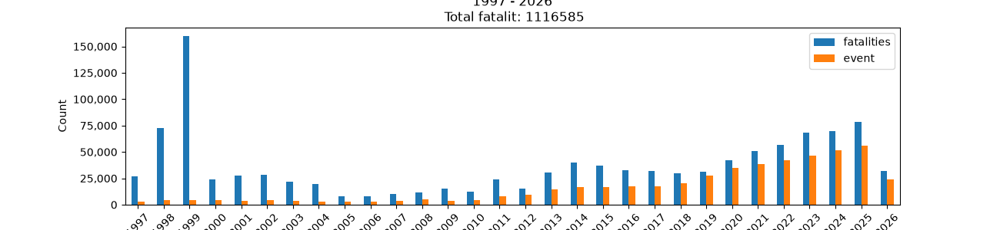
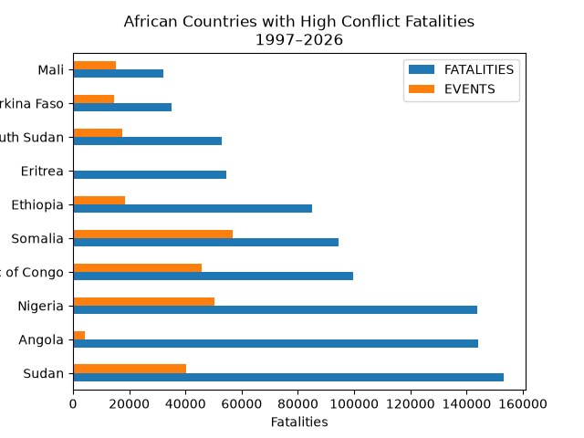
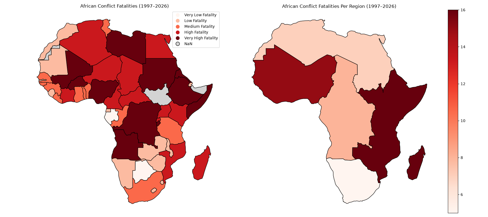
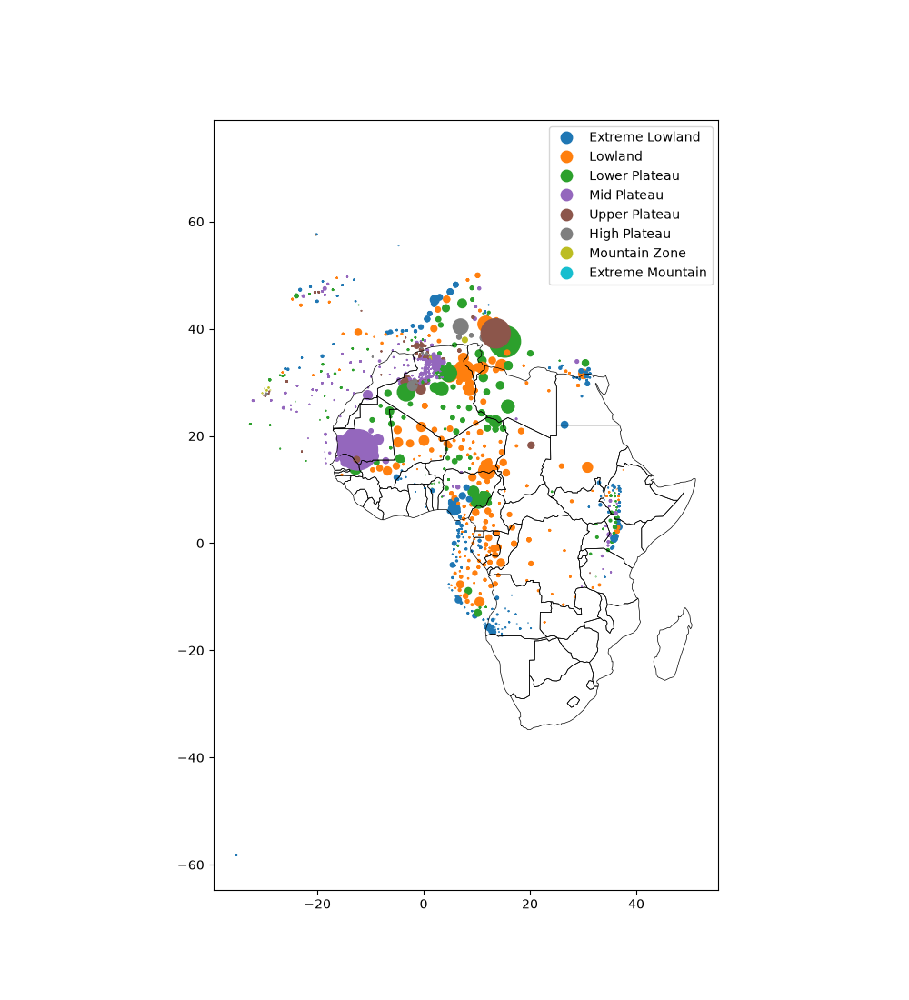
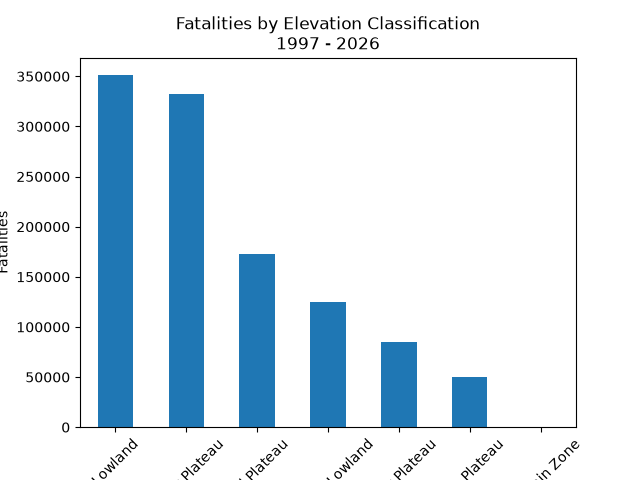

# Conflict Dynamics in Africa (1997–2026)
## Project Overview
This project investigates the spatial and temporal dynamics of conflict across Africa from 1997 to 2026. The analysis focuses on conflict events and fatalities, examining their distribution across time, geography, and elevation. The study integrates temporal trend analysis with geospatial methods to identify conflict hotspots and explore potential environmental influences on conflict patterns.
The dataset has also been enriched with elevation data derived from NASA’s SRTM Digital Elevation Model (DEM), enabling analysis of terrain influences on conflict intensity.

1. **Temporal Trends of Conflict**
### Key Findings
- Conflict fatalities peaked in 1999, reaching 159,821 deaths, the deadliest year in the dataset. 
- A period of relative decline occurred between 2000 and 2006, with significantly lower fatality levels. 
- From 2014 onward, fatalities increased steadily, reaching 78,814 deaths in 2025, the highest sustained level since the late 1990s. 
- Conflict events show a continuous upward trend, increasing from fewer than 5,000 annual events in the early period to 55,868 events in 2025. 
- The simultaneous rise in both events and fatalities after 2010 suggests increasingly widespread and persistent conflict activity. 
### Major Conflict Phases
1.	High-Intensity Phase (1997–1999): Extremely high fatalities and peak violence 
2.	Decline Phase (2000–2006): Reduced fatalities and moderate activity 
3.	Expansion Phase (2007–2013): Gradual increase in conflict events 
4.	Escalation Phase (2014–2025): Sustained growth in both fatalities and events

   

2. **Spatial Distribution of Conflict Fatalities**
Conflict fatalities are highly unevenly distributed across Africa, with a small number of countries accounting for a large proportion of total deaths.
### Key Findings
- Major conflict hotspots include:
  - Ethiopia, Somalia, Eritrea, Sudan, Nigeria, South Sudan, Libya
  - Democratic Republic of Congo, Mali, Burkina Faso 
- Eastern Africa shows the highest regional fatality burden, driven mainly by Ethiopia, Somalia, and Eritrea. 
- Western Africa also records high conflict intensity, particularly in Nigeria, Mali, and Burkina Faso. 
- Southern Africa remains comparatively stable with consistently low fatality levels. 
- Conflict severity varies across scales, with some countries remaining hotspots at both national and regional levels. 

   

3. **Spatial Distribution of Fatalities with Elevation Context (SRTM)**
This section integrates elevation data derived from NASA SRTM DEM with conflict fatalities to examine terrain-related patterns.
### Key Spatial Findings
- Fatalities form distinct regional clusters rather than a uniform distribution. 
- The highest concentration of fatalities is observed in Northwest African coastal lowlands, the primary hotspot in the dataset. 
- Additional clusters appear in Northern Africa and Western Africa, though with lower intensity. 
- A notable cluster is also present in Central Africa, particularly toward its western regions. 
- Most coastal and northern water-adjacent zones show relatively low fatality counts. 
- East Africa and Southern Africa are generally low in fatalities, except localized hotspots in: 
  - Western Ethiopia 
  - Western Kenya 

<table><tr><td></td>
    <td></td></tr></table>
  
### Elevation (SRTM) Patterns
- Fatalities are strongly concentrated in lowland and lower-elevation zones. 
- High-elevation regions show significantly fewer fatalities overall. 
- This suggests that conflict intensity is generally higher in accessible, low-lying terrain. 

### Combined Interpretation
- Primary hotspot: Northwest African coastal lowlands 
- Secondary hotspots: Northern Africa and Western Africa (low elevation zones) 
- Central Africa: Moderate clustering in western lowlands 
- Outliers: Western Ethiopia and Western Kenya 
- Elevation effect: Lowlands consistently experience higher fatalities than highlands 

4. **Overall Summary**
The analysis shows that conflict in Africa between 1997 and 2026 is characterized by:
- A long-term increase in both fatalities and conflict events 
- Strong geographic clustering in a limited number of regions 
- Concentration of violence in low-elevation (lowland) areas 
- Persistent hotspots in Eastern, Western, and parts of Central Africa 
Overall, conflict is not uniformly distributed but shaped by both spatial geography and terrain characteristics.

5. Data Sources
### Conflict Data
- Armed Conflict Location & Event Data Project (ACLED) 
- Dataset: Africa_aggregated_data_up_to_week_of_2026-06-06 
- https://acleddata.com/aggregated/aggregated-data-africa 
### Elevation Data
- NASA Shuttle Radar Topography Mission (SRTM) Digital Elevation Model (DEM) 
- Elevation extracted using event geographic coordinates 

6. **Citation**
- ACLED (Armed Conflict Location & Event Data Project). Aggregated Data for Africa. https://acleddata.com/aggregated/aggregated-data-africa
- NASA Shuttle Radar Topography Mission (SRTM). Digital Elevation Model (DEM) Data. 

7. **Disclaimer**
This repository contains original analysis and visualizations developed by the author. Interpretations and conclusions are independent and do not necessarily reflect the views of ACLED, NASA, or affiliated institutions.

8. **Ongoing Development**
This project is an ongoing effort to build a geospatial analytical framework for understanding conflict dynamics in Africa. Future updates will include:
- Environmental variables (water access, climate, land use) 
- Political datasets (elections, governance indicators) 
- Resource distribution (minerals, energy) 
- Ocean bathymetry and coastal depth data 
- Advanced statistical and predictive modeling 

9. **Research Questions (Future Work)**
- How does elevation influence conflict intensity and fatalities? 
- Does access to water resources affect conflict dynamics? 
- Are election periods associated with conflict escalation? 
•	Do mineral-rich regions experience higher conflict levels? 
•	What combination of factors best explains spatial conflict patterns?
