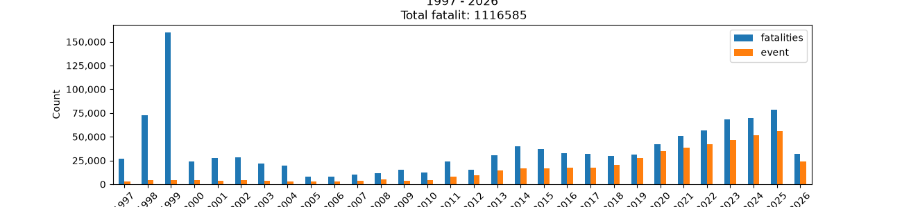
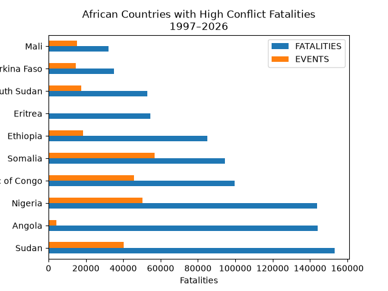
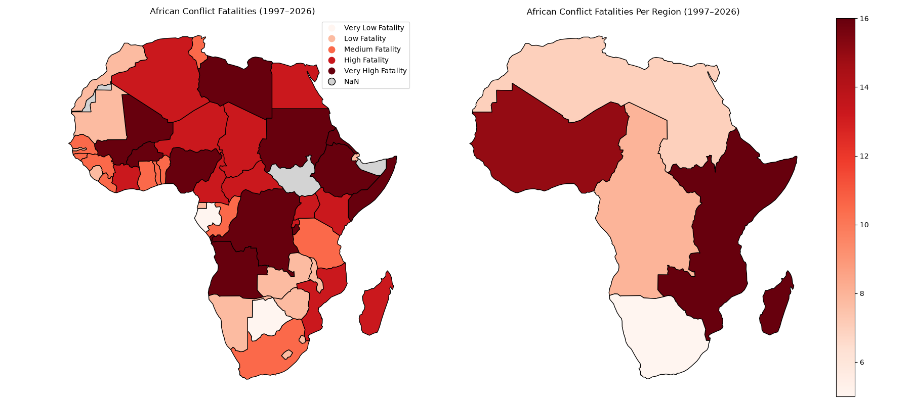
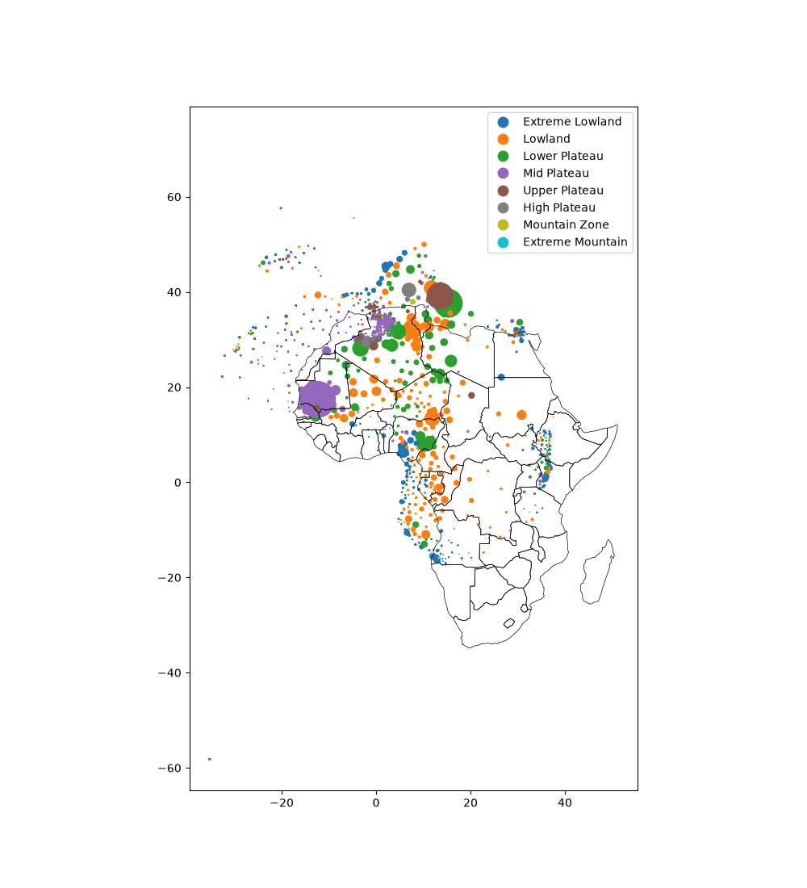
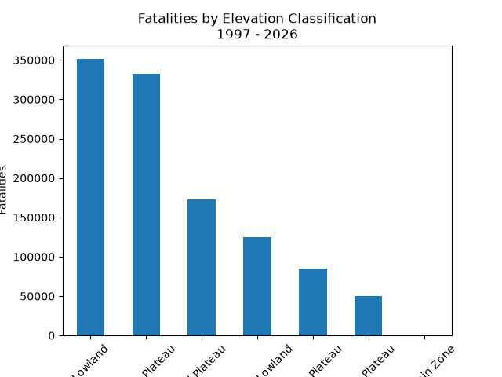
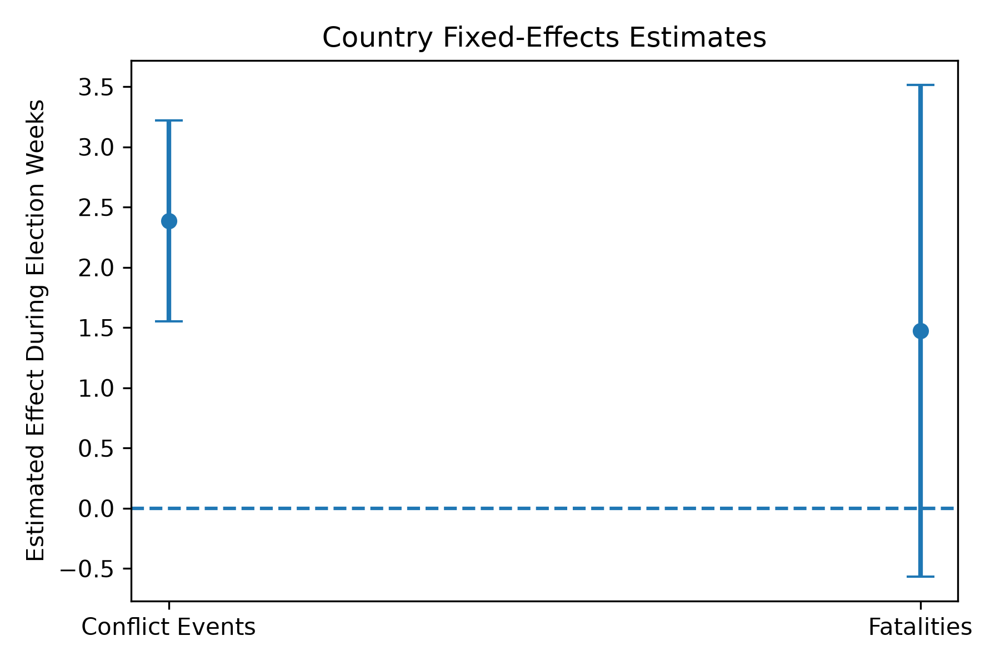

## Conflict Dynamics in Africa (1997–2026)
## Project Overview
This project investigates the spatial and temporal dynamics of conflict across Africa from 1997 to 2026. The analysis focuses on conflict events and fatalities, examining their distribution across time, geography, and elevation. The study integrates temporal trend analysis with geospatial methods to identify conflict hotspots and explore potential environmental influences on conflict patterns.
The dataset has also been enriched with elevation data derived from NASA’s SRTM Digital Elevation Model (DEM), enabling analysis of terrain influences on conflict intensity.

1. **Temporal Trends of Conflict**
### Key Findings
  - Conflict fatalities peaked in 1999, reaching 159,821 deaths, the deadliest year in the dataset. 
  - A period of relative decline occurred between 2000 and 2006, with significantly lower fatality levels. 
  - From 2014 onward, fatalities increased steadily, reaching 78,814 deaths in 2025, the highest sustained level since the late 1990s. 
  - Conflict events show a continuous upward trend, increasing from fewer than 5,000 annual events in the early period to 55,868 events in 2025. 
  - The simultaneous rise in both events and fatalities after 2010 suggests increasingly widespread and persistent conflict activity. 
### Major Conflict Phases
1.	High-Intensity Phase (1997–1999): Extremely high fatalities and peak violence 
2.	Decline Phase (2000–2006): Reduced fatalities and moderate activity 
3.	Expansion Phase (2007–2013): Gradual increase in conflict events 
4.	Escalation Phase (2014–2025): Sustained growth in both fatalities and events

<p align="center"></p>   
<p align="center"></p>

2. **Spatial Distribution of Conflict Fatalities**
Conflict fatalities are highly unevenly distributed across Africa, with a small number of countries accounting for a large proportion of total deaths.
### Key Findings
- Major conflict hotspots include:
  - Ethiopia, Somalia, Eritrea, Sudan, Nigeria, South Sudan, Libya
  - Democratic Republic of Congo, Mali, Burkina Faso 
- Eastern Africa shows the highest regional fatality burden, driven mainly by Ethiopia, Somalia, and Eritrea. 
- Western Africa also records high conflict intensity, particularly in Nigeria, Mali, and Burkina Faso. 
- Southern Africa remains comparatively stable with consistently low fatality levels. 
- Conflict severity varies across scales, with some countries remaining hotspots at both national and regional levels. 

<p align="center"></p>   

3. **Spatial Distribution of Fatalities with Elevation Context (SRTM)**
This section integrates elevation data derived from NASA SRTM DEM with conflict fatalities to examine terrain-related patterns.
### Key Spatial Findings
- Fatalities form distinct regional clusters rather than a uniform distribution. 
- The highest concentration of fatalities is observed in Northwest African coastal lowlands, the primary hotspot in the dataset. 
- Additional clusters appear in Northern Africa and Western Africa, though with lower intensity. 
- A notable cluster is also present in Central Africa, particularly toward its western regions. 
- Most coastal and northern water-adjacent zones show relatively low fatality counts. 
- East Africa and Southern Africa are generally low in fatalities, except localized hotspots in: 
  - Western Ethiopia 
  - Western Kenya 

<table><tr><td></td>
    <td></td></tr></table>
  
### Elevation (SRTM) Patterns
  - Fatalities are strongly concentrated in lowland and lower-elevation zones. 
  - High-elevation regions show significantly fewer fatalities overall. 
  - This suggests that conflict intensity is generally higher in accessible, low-lying terrain. 

### Combined Interpretation
  - Primary hotspot: Northwest African coastal lowlands 
  - Secondary hotspots: Northern Africa and Western Africa (low elevation zones) 
  - Central Africa: Moderate clustering in western lowlands 
  - Outliers: Western Ethiopia and Western Kenya 
  - Elevation effect: Lowlands consistently experience higher fatalities than highlands 

4. **Overall Summary**
The analysis shows that conflict in Africa between 1997 and 2026 is characterized by:
  - A long-term increase in both fatalities and conflict events 
  - Strong geographic clustering in a limited number of regions 
  - Concentration of violence in low-elevation (lowland) areas 
  - Persistent hotspots in Eastern, Western, and parts of Central Africa 
Overall, conflict is not uniformly distributed but shaped by both spatial geography and terrain characteristics.

5. **Data Sources**
### Conflict Data
  - Armed Conflict Location & Event Data Project (ACLED) 
  - Dataset: Africa_aggregated_data_up_to_week_of_2026-06-06 
  - https://acleddata.com/aggregated/aggregated-data-africa 
### Elevation Data
  - NASA Shuttle Radar Topography Mission (SRTM) Digital Elevation Model (DEM) 
  - Elevation extracted using event geographic coordinates 

6. **Citation**
  - ACLED (Armed Conflict Location & Event Data Project). Aggregated Data for Africa. https://acleddata.com/aggregated/aggregated-data-africa
  - NASA Shuttle Radar Topography Mission (SRTM). Digital Elevation Model (DEM) Data. 

7. **Disclaimer**
This repository contains original analysis and visualizations developed by the author. Interpretations and conclusions are independent and do not necessarily reflect the views of ACLED, NASA, or affiliated institutions.

8. **Ongoing Development**
This project is an ongoing effort to build a geospatial analytical framework for understanding conflict dynamics in Africa. Future updates will include:
  - Environmental variables (water access, climate, land use) 
  - Political datasets (elections, governance indicators) 
  - Resource distribution (minerals, energy) 
  - Ocean bathymetry and coastal depth data 
  - Advanced statistical and predictive modeling 

9. **Research Questions (Future Work)**
  - How does elevation influence conflict intensity and fatalities? 
  - Does access to water resources affect conflict dynamics? 
  - Are election periods associated with conflict escalation? 
  - Do mineral-rich regions experience higher conflict levels? 
  - What combination of factors best explains spatial conflict patterns?


# Africa Conflict Dynamics (1997–2026)

## Version 2: Election Period and Conflict Analysis

## Overview

This project investigates the relationship between election periods and conflict dynamics across African countries using conflict event data and national election records. The objective is to determine whether elections are associated with changes in the frequency of conflict events and conflict-related fatalities.

The analysis combines conflict data from 1997–2026 with parliamentary and presidential election data from 1997–2023. Rather than relying solely on descriptive comparisons, the study applies country fixed-effects regression models to estimate whether conflict changes within the same country during election periods.

---

## Research Question

Are election periods associated with increases in:

* Conflict events?
* Conflict-related fatalities?

---

## Data

### Conflict Data

* Study period: 1997–2026
* Unit of observation (raw data): Individual conflict events
* Geographic coverage: African countries

### Election Data

* Parliamentary elections
* Presidential elections
* Study period: 1997–2023

Election records were matched to conflict events using ISO3 country codes.

---

## Methodology

### Election Window

Each election was assigned a **±60-day window**, meaning conflict events occurring within 60 days before or after an election were classified as occurring during an election period.

### Why Weekly Analysis?

Election periods represent relatively short time windows (±60 days around each election), whereas non-election periods cover the remainder of the study period. Because non-election periods span substantially more time, directly comparing the total number of conflict events or fatalities between election and non-election periods would be misleading. The longer observation period would naturally contain more recorded events, regardless of any election effect.

To ensure a fair comparison, conflict events were aggregated into **weekly country-level observations**. Weekly aggregation standardizes the time unit so that election weeks and non-election weeks are compared on the same temporal scale rather than by total counts accumulated over unequal periods.

### Balanced Country-Week Dataset

To avoid bias from analyzing only weeks in which conflict occurred, a balanced country-week dataset was constructed. This dataset contains every country for every calendar week within the study period, including weeks with zero recorded conflict events and zero fatalities. Missing observations after aggregation therefore represent true zero-conflict weeks rather than missing data.

### Country Fixed-Effects Model

The primary analysis uses a country fixed-effects regression model.

This model compares each country with its own historical pattern instead of comparing different countries with one another. Consequently, time-invariant characteristics such as geography, long-term political institutions, historical conflict propensity, and other stable country-specific factors are controlled for automatically.

The estimated election coefficient therefore measures whether conflict outcomes change during election weeks within the same country.
The models were estimated using the PanelOLS estimator from the linearmodels package with country fixed effects and cluster-robust standard errors at the country level.

---

## Results

### Conflict Events

The country fixed-effects model indicates that election periods are associated with a modest but statistically significant increase in weekly conflict events.

* Estimated effect: **+2.39 conflict events per week**
- This is an average within-country effect.
* Statistical significance: **p = 0.004**

## Interpretation

On average, a country experiences approximately 2.4 additional conflict events during election weeks compared with its own non-election weeks.

### Conflict Fatalities

The model does not find evidence that election periods significantly increase weekly conflict fatalities.

* Estimated effect: **+1.47 fatalities per week**
* Statistical significance: **p = 0.470**

---

## Interpretation

The findings suggest that election periods are associated with an increase in the frequency of conflict incidents but not with a statistically significant increase in conflict lethality.

These results indicate that elections may elevate political tensions and increase the occurrence of conflict events without systematically increasing the number of conflict-related deaths. 
The estimated increase in fatalities is small and not statistically significant, indicating that election periods do not systematically increase the lethality of conflict.

---
<p align="center"></p>   
## Limitations

- The analysis estimates associations rather than definitive causal effects.
- Election periods are defined using a ±60-day window; alternative window lengths may produce different estimates.
- The current models control for country-specific fixed characteristics but do not yet include additional time-varying factors such as natural resource production, economic conditions, or climate variability.

## Repository Structure

```text
data/
figures/
notebooks/
scripts/
results/
README.md
```

---

## Current Project Status

**Version 1**

* Data preparation
* Descriptive conflict analysis
* Geographic and elevation analysis

**Version 2**

* Election window construction (±60 days)
* Weekly country-level aggregation
* Balanced country-week dataset
* Country fixed-effects regression
* Election impact assessment on conflict events and fatalities

---
**Citation**

@misc{MarxPonsRollet2025NationalElections,
	author = {Benjamin Marx and Vincent Pons and Vincent Rollet},
	title = {National Elections Database (Version 2.0)},
	year = {2025},
	url = {http://nationalelectionsdatabase.com}}
## Future Work

Planned extensions include examining whether conflict dynamics differ according to:

* Natural resource availability
* Elevation and terrain
* Climate zones
* Population exposure
* Conflict type
* Regional variation across Africa

